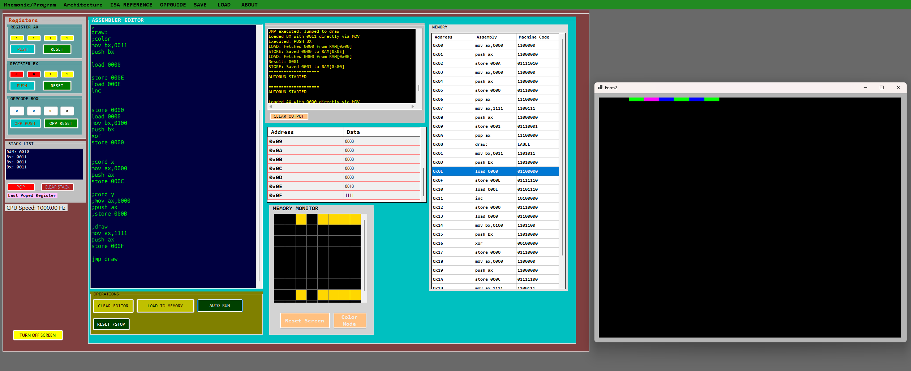
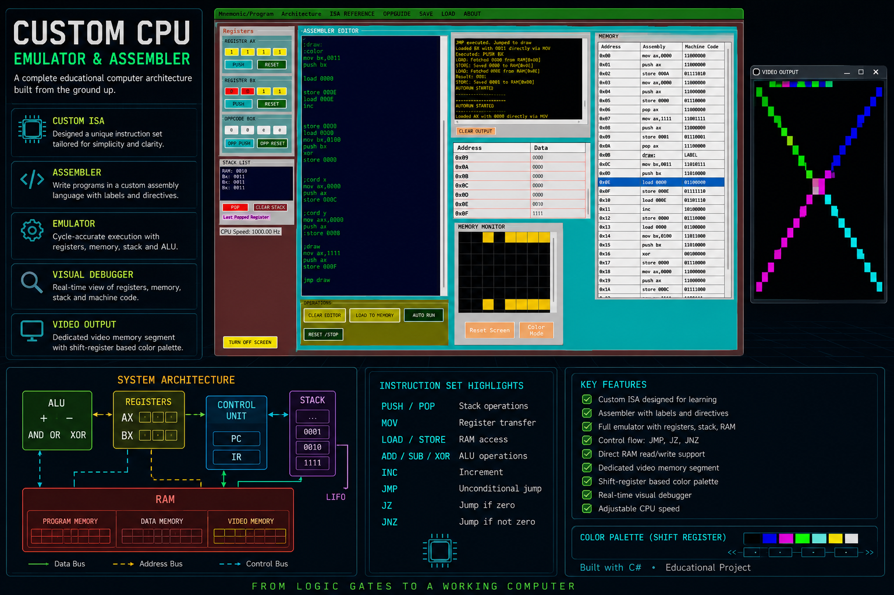
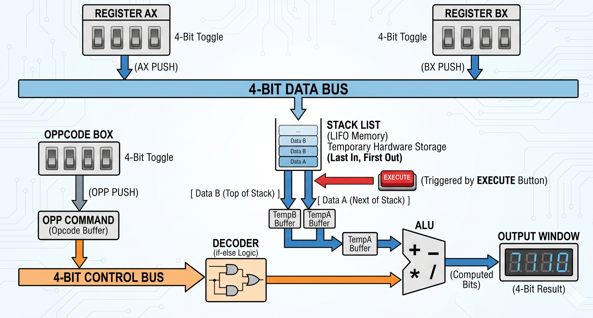
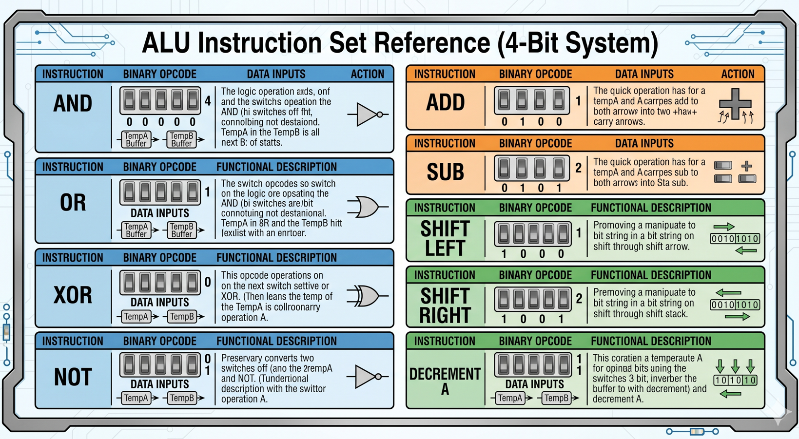
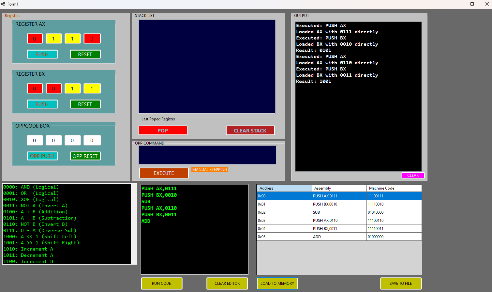


#UPDATE 09.06.2026
full document 


# BIT4 — A Handcrafted 4-bit Computer Emulator

A fully custom 4-bit computer architecture built from scratch in C# and WinForms.
Every layer — CPU, ALU, RAM, ROM, VPU, assembler — is hand-implemented with no shortcuts or emulation frameworks.

---

## Architecture Overview

BIT4 is a stack-based 4-bit computer. The data bus is 4 bits wide, instructions are encoded in 8 bits, and all hardware components communicate through a memory-mapped I/O system — exactly how real hardware works.

```
┌─────────────────────────────────────────────────────┐
│                     CPU CORE                        │
│  ┌──────────┐  ┌──────────┐  ┌────────────────────┐│
│  │  AX REG  │  │  BX REG  │  │   PROGRAM COUNTER  ││
│  │  4-bit   │  │  4-bit   │  │   + LABEL MEMORY   ││
│  └──────────┘  └──────────┘  └────────────────────┘│
│  ┌──────────────────────────────────────────────────┤
│  │              ALU (16 Operations)                 │
│  │  AND OR XOR NOT ADD SUB SHL SHR INC DEC          │
│  └──────────────────────────────────────────────────┤
│  ┌──────────┐  ┌──────────┐  ┌────────────────────┐│
│  │  STACK   │  │ZERO FLAG │  │    CALL STACK      ││
│  │ (LIFO)   │  │          │  │    (CALL/RET)      ││
│  └──────────┘  └──────────┘  └────────────────────┘│
└─────────────────────────────────────────────────────┘
         │                          │
┌────────▼────────┐      ┌─────────▼──────────┐
│   DATA MEMORY   │      │        VPU          │
│   16 bytes RAM  │      │  512×512 Display    │
│  + I/O Port Map │      │  Pixel Buffer       │
└─────────────────┘      │  Color Attribute    │
                         │  Matrix (4096 cells)│
                         └─────────────────────┘
                                  │
                         ┌────────▼────────┐
                         │  CHARACTER ROM  │
                         │  4 Pages        │
                         │  64 Characters  │
                         └─────────────────┘
```

---

## CPU

### Registers
| Register | Width | Purpose |
|----------|-------|---------|
| AX | 4-bit | Primary general purpose register |
| BX | 4-bit | Secondary general purpose register |
| PC | int | Program counter, tracks execution line |
| ZeroFlag | bool | Set when last ALU result was 0000 |

### Stack
The CPU is **stack-based**. All ALU operations read operands from the stack and push results back. This is similar in philosophy to Forth machines and the JVM — cleaner and more minimal than register-heavy designs.

---

## Instruction Set

### Data Movement
| Instruction | Encoding | Description |
|-------------|----------|-------------|
| `MOV AX, xxxx` | `1100xxxx` | Load 4-bit immediate into AX |
| `MOV BX, xxxx` | `1101xxxx` | Load 4-bit immediate into BX |
| `PUSH AX` | `11000000` | Push AX onto stack |
| `PUSH BX` | `11010000` | Push BX onto stack |
| `POP AX` | `11100000` | Pop top of stack into AX |
| `POP BX` | `11110000` | Pop top of stack into BX |

### Memory
| Instruction | Encoding | Description |
|-------------|----------|-------------|
| `LOAD 0x??` | `0110xxxx` | Read RAM address, push to stack |
| `STORE 0x??` | `0111xxxx` | Pop stack, write to RAM address |

### ALU — Logical
| Instruction | Opcode | Description |
|-------------|--------|-------------|
| `AND` | `0000` | Bitwise AND (binary) |
| `OR` | `0001` | Bitwise OR (binary) |
| `XOR` | `0010` | Bitwise XOR (binary) |
| `NOT` | `0011` | Bitwise NOT (unary) |

### ALU — Arithmetic
| Instruction | Opcode | Description |
|-------------|--------|-------------|
| `ADD` | `0100` | 4-bit addition (binary) |
| `SUB` | `0101` | 4-bit subtraction (binary) |
| `INC` | `1010` | Increment by 1 (unary) |
| `DEC` | `1011` | Decrement by 1 (unary) |
| `SHL` | `1000` | Shift left (unary) |
| `SHR` | `1001` | Shift right (unary) |

### Control Flow
| Instruction | Encoding | Description |
|-------------|----------|-------------|
| `JMP label` | `11111111` | Unconditional jump |
| `JZ label` | `11111110` | Jump if ZeroFlag is set |
| `JNZ label` | `11111011` | Jump if ZeroFlag is clear |
| `CALL label` | `11111101` | Push return address, jump to label |
| `RET` | `11111100` | Pop return address, jump back |

### VPU
| Instruction | Encoding | Description |
|-------------|----------|-------------|
| `PRINT` | `11110111` | Pop stack, look up char in ROM, draw to screen |

---

## Memory Map

### RAM (16 bytes, 0x00–0x0F)
| Address | Conventional Use |
|---------|-----------------|
| 0x00 | General purpose |
| 0x01 | General purpose |
| ... | General purpose |
| 0x08 | **INPUT PORT** — keyboard state (read-only hardware intercept) |
| 0x09 | **VPU ROM PAGE** — write to switch active character ROM bank |
| 0x0A | **CLS** — clear screen hardware intercept |
| 0x0B | **NEWLINE** — cursor Y-jump hardware intercept |
| 0x0C | **FAST FWD** — cursor X-skip hardware intercept |
| 0x0D | **VSYNC/HOME** — reset cursor to 0,0 |
| 0x0E | **COLOR** — set active palette color (0–15) |
| 0x0F | **DRAW** — stream 4 pixels to screen |

Addresses 0x08–0x0F are **hardware-intercepted** — writing or reading them triggers real hardware actions instead of normal RAM access.

---

## VPU (Video Processing Unit)

The display system uses a **two-layer architecture** identical to the ZX Spectrum:

**Layer 1 — Pixel Buffer:** 512×512 monochrome boolean array. Stores which pixels are on or off.

**Layer 2 — Color Attribute Matrix:** 4096-cell grid (64×64 blocks of 8×8 pixels each). Each cell stores a 4-bit color code. This means color is applied per-block, not per-pixel — authentic to real 1980s hardware.

### Color Palette (CGA — 16 colors)
| Code | Binary | Color |
|------|--------|-------|
| 0 | 0000 | Black |
| 1 | 0001 | Dark Blue |
| 2 | 0010 | Dark Green |
| 3 | 0011 | Dark Cyan |
| 4 | 0100 | Dark Red |
| 5 | 0101 | Dark Magenta |
| 6 | 0110 | Brown |
| 7 | 0111 | Light Gray |
| 8 | 1000 | Dark Gray |
| 9 | 1001 | Bright Blue |
| 10 | 1010 | Bright Green |
| 11 | 1011 | Bright Cyan |
| 12 | 1100 | Bright Red |
| 13 | 1101 | Bright Magenta |
| 14 | 1110 | Bright Yellow |
| 15 | 1111 | Pure White |

This is the exact CGA palette used in IBM PC hardware from 1981.

---

## Character ROM

64 characters across 4 pages, each character is a 4×5 pixel bitmap:

| Page | Address (0x09) | Characters |
|------|----------------|------------|
| 0 | `0000` | A–P |
| 1 | `0001` | Q–Z, brackets, symbols |
| 2 | `0010` | ! " # $ % & ' ( ) * + , - . / ? |
| 3 | `0011` | 0–9, : ; < = > |

### Switching ROM Pages
```asm
mov ax,0001   ; page 1
push ax
store 0009    ; write to ROM page selector port
```

---

## Keyboard Input

Keyboard state is read from the hardware input port at address `0x08`.

| Code | Binary | Key |
|------|--------|-----|
| 0 | 0000 | No key |
| 1 | 0001 | UP |
| 2 | 0010 | DOWN |
| 3 | 0011 | LEFT |
| 4 | 0100 | RIGHT |
| 5 | 0101 | SPACE |
| 6 | 0110 | Z |
| 7 | 0111 | X |

```asm
load 0008        ; read keyboard into stack
mov ax,0001      ; UP arrow code
push ax
xor
jz up_pressed    ; jump if UP is held
pop ax
```

---

## Assembly Examples

### Print "HELLO" on screen
```asm
; Switch to page 0 (A-P)
mov ax,0000
push ax
store 0009

; H = ID 7
mov ax,0111
push ax
print

; E = ID 4
mov ax,0100
push ax
print

; L = ID 11
mov ax,1011
push ax
print

; L = ID 11
mov ax,1011
push ax
print

; O = ID 14
mov ax,1110
push ax
print
```

### Print all 64 characters (full ROM dump)
```asm
; === INIT ===
mov ax,0000
push ax
store 0000      ; page counter

mov ax,0000
push ax
store 0001      ; char counter

mov ax,0000
push ax
store 0009      ; ROM page 0

; === MAIN LOOP ===
shift:
load 0001
print

load 0001
mov ax,1111
push ax
xor
jz in_rom
pop ax

load 0001
inc
store 0001
jmp shift

; === PAGE SWITCH ===
in_rom:
pop ax
load 0000
inc
store 0000

load 0000
mov ax,0100
push ax
xor
jz done
pop ax

load 0000
store 0009

mov ax,0000
push ax
store 0001
jmp shift

; === END ===
done:
pop ax
```

---

## Historical Comparison

| Feature | BIT4 | Intel 4004 (1971) | Atari 2600 (1977) | ZX Spectrum (1982) |
|---------|------|-------------------|-------------------|-------------------|
| Data bus | 4-bit | 4-bit | 8-bit | 8-bit |
| RAM | 16 bytes | 640 bytes | 128 bytes | 48KB |
| ROM | 64 chars / 4 pages | Paged ROM | Cart ROM | 16KB |
| CPU style | Stack-based | Accumulator | Accumulator | Accumulator |
| Color system | Attribute matrix | None | Scanline sprites | Attribute matrix |
| Palette | 16 colors (CGA) | None | 128 colors | 16 colors |
| Memory mapped I/O | Yes | No | Yes (TIA chip) | Yes |
| Separate VPU | Yes | No | Yes (TIA) | Yes (ULA) |

BIT4 sits architecturally between the Intel 4004 and Atari 2600, with a VPU design nearly identical to the ZX Spectrum ULA and an exact CGA color palette. The stack-based CPU design is closer to Forth machines of the late 1970s than to mainstream processors of the era — considered an elegant minimal approach.

---

## Project Structure

```
WinFormsApp1/
├── Models/
│   ├── Assembler.cs       — Parser, instruction executor, program counter
│   ├── AluInputBuffer.cs  — ALU input staging and opcode dispatch
│   ├── Alu.cs             — Core ALU operations
│   ├── Register.cs        — 4-bit register model
│   ├── DataMemory.cs      — 16-byte RAM + hardware port intercepts
│   ├── ComputerMonitor.cs — VPU, pixel buffer, color attribute matrix
│   ├── CharacterRom.cs    — 4-page character bitmap ROM
│   ├── HardwarePalette.cs — CGA 16-color palette
│   └── InputPort.cs       — Keyboard hardware input port
└── Forms/
    └── Form1.cs           — WinForms UI, rendering loop, key events
```

---

## Built With

- C# / .NET
- WinForms
- No emulation frameworks — every component hand-implemented

---

*A personal project to understand how real computers work from the ground up — CPU, memory, video, and input all built by hand.*


# HUGE UPDATE 07.06.2026


Over the last I've implemented several major architecture improvements:

- **Seperated `MOV ` and `PUSH` instructions 
```assembly
mov ax,1011
push ax
```
- ** `PUSH` is dedicated to stack operations only
- **Added direct RAM access instructions

- **Read and write data through dedicated memory operations
- **Improved overall memory handling and program structure
- **Implemented control flow instructions
```bash
JMP
JZ (Jump if Zero)
JNZ (Jump if Not Zero)
```

This finally enables loops, branching, and more complex programs.

## Added a dedicated video memory segment
- The CPU can now drive its own display system
- Graphics output is controlled through memory-mapped video registers
- A color palette system based on shift registers is now operational

## What started as a simple ALU experiment has gradually evolved into a complete educational CPU architecture featuring:

-**• Custom ISA
-**• Registers
-**• Stack
-**• RAM
-**• Program Counter
-**• Labels & branching
-**• Video memory
-**• Color palette support


# Custom 4-Bit Retro Microprocessor Emulator & Assembler

A custom software-simulated 4-Bit Microprocessor Architecture built in C# (WinForms) to emulate early-generation computer hardware behavior. This project bridges high-level software controls with strict hardware logic constraints, featuring a stack-based ALU, discrete registers, and a custom Assembler.

## Project Overview

This emulator simulates a complete 4-bit hardware execution cycle (Fetch, Decode, Execute) running over a shared 4-bit data bus. It includes an integrated Assembler that parses human-readable assembly mnemonics, encodes them into 8-bit machine words (4-bit opcode + 4-bit data/padding), loads them into program memory, and executes them through simulated logic gates.

### Key Features

- **Hardware Registers:** Two 4-bit general-purpose data registers (`AX` and `BX`).
- **Memory Stack:** A strict First-In, Last-Out (FILO/LIFO) sequential hardware stack acting as the primary data highway for ALU operations.
- **Arithmetic Logic Unit (ALU):** A combinational logic core performing bitwise operations (`AND`, `OR`, `XOR`, `NOT`), shift operations (`SHL`, `SHR`), and arithmetic operations (`ADD`, `SUB`, `INC`, `DEC`).
- **Dual Execution Modes:** Fully supports both **Single-Step** hardware debugging (line-by-line tracing) and **Batch Processing** (top-to-bottom execution).
- **UI Synchronization:** Real-time visual updating of binary state boxes, stack lists, and memory grids inside the WinForms interface.

---

## Hardware Execution Rules

- **AluBuffer:** Immediately before any operation runs, the ALU pops two values from the stack. The first popped value lands in TempB, and the second value lands in TempA.
- **Unary Operations:** For operations requiring only one operand (e.g., SHL, SHR, INC), the processor still forces the ALU to pop 2 values due to the shared hardware architecture. A dummy value must be pushed second to satisfy the TempB latch while the target data sits in TempA.
- **Bus Isolation:** All internal buffers are automatically flushed via ClearBuffers() at the end of every successful execution cycle to prevent residual data leakage into the next clock pulse.

## Project Structure & Documentation

All deep technical documentation and hardware specifications are organized within the dedicated documentation folder:

- **`documents/`**
  - `4-Bit Custom CPU Datasheet`: Contains full hardware component maps, schematic definitions, and execution cycle phase descriptions.
  - `Custom 4-Bit Microprocessor - ISA Reference Manual`: Detailed reference manual detailing every supported mnemonic, binary opcode mapping, and exact buffer routing logic.

---

## Sample Assembly Program

The following sample program demonstrates loading immediate data into registers, utilizing the hardware stack, and executing arithmetic operations via the ALU:

```assembly
PUSH AX, 0111  ; Load binary 0111 (Decimal 7) into AX and push to stack
PUSH BX, 0010  ; Load binary 0010 (Decimal 2) into BX and push to stack
SUB            ; Pops 0010 (TempB) and 0111 (TempA) -> Executes 7 - 2 = 5 (0101)
PUSH AX, 0110  ; Load binary 0110 (Decimal 6) into AX and push to stack
PUSH BX, 0011  ; Load binary 0011 (Decimal 3) into BX and push to stack
ADD            ; Pops 0011 (TempB) and 0110 (TempA) -> Executes 6 + 3 = 9 (1001)

```
### Screenshots 




